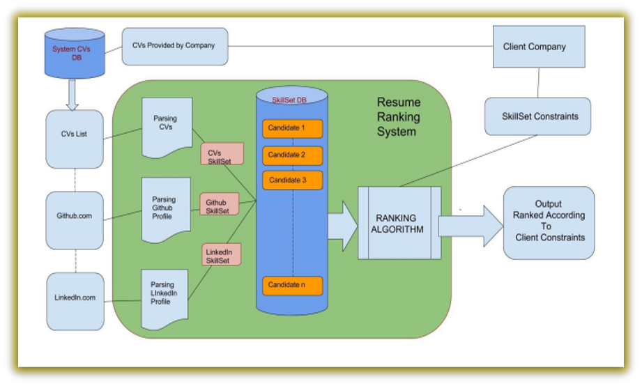

# ProHireX - EY GDS Hackpions 3.0 : CV Screening
</img>

## Problem Statement

Recruiting is a large volume process that involves shortlisting of CVs against a requisition/JD – an extremely time consuming and labour intensive process that sometimes leaves qualified CVs overlooked.

CV screening against a job description, if automated, could help save tremendous effort for the frontline recruiting teams.

The solution should screen all input CVs against a JD identified and rate the CVs of the candidates based on relevancy, experience, skills etc.

CV screening against an identified JD and rating the CVs based on different parameters including experience, relevance, skills, location and education background.

## System Architecture

</img>

## Idea

Finding the Right Person for the Right Job has never been an easy task for the Companies.

In recent years, more and more Jobs are rapidly growing pools of potential candidates, requiring respective Recruiters to wade through Hundreds or Thousands of CV’s to find the perfect match.

When there is large number of Candidates, the Automation can also include a more challenging task: Scoring and Ranking Candidates’ CVs according to their match to a Job Description. This task is implicitly performed by a search engine retrieval model, which computes Ranking based on the keyword match.

## Instructions

1. Clone the repository into your local system.
2. Extract the downloaded file and open the folder in VS Code.
3. Open the terminal and then install all the requirements by running - `pip install PyPDF2`, `pip install textract`, `pip install gensim`, `pip install sklearn`, `pip install requests`, `pip install flask`, `pip install numpy`, `pip install pdfminer`, `pip install textract`.
4. Now run `python app.py`.
5. Open in the local host by clicking on the `http://localhost:8000/`.
6. Press CTRL+C to close.

## Tech Stack

Python, Flask, Artificial Intelligence, Machine learning, HTML, CSS, Natural Language Processing, Beautifulsoup, Natural Language Toolkit (NLTK), Scikit-learn.

## Conclusion

The Main Feature of ProHireX Software is that it screens the entire CV database to select and display the CV, which fit best for the provided Job Description(JD). This is achieved by assigning a Rank to each CV by Intelligently comparing them against the corresponding Job Description.

## Contributor

- [Saurabh Raj](https://github.com/rajsaurabh1000)
- [Sumit Raj]
